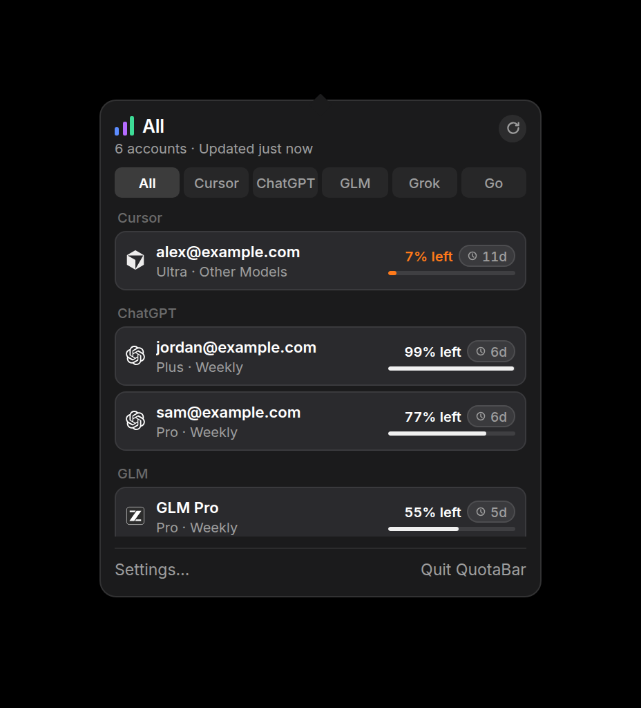
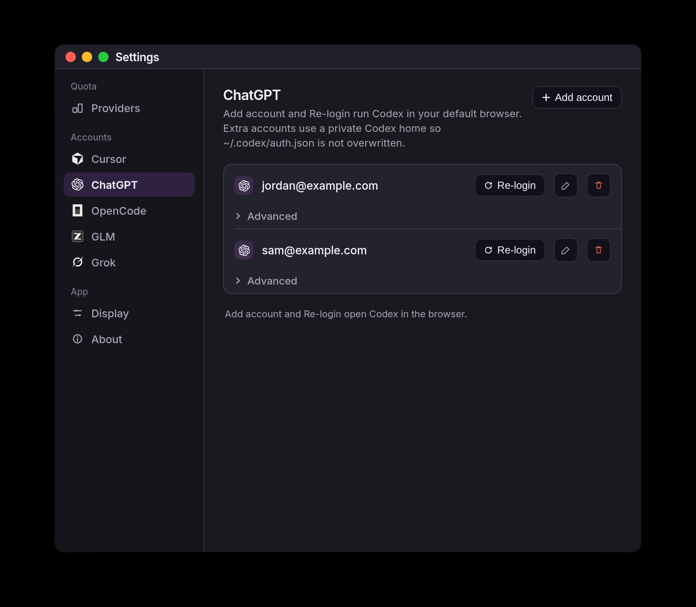

# QuotaBar

A menu-bar-only macOS 14+ utility (**0.0.17**) that shows remaining **Cursor**, **ChatGPT**, **GLM**, **Grok**, and **OpenCode Go** quota. One pill in the status bar, one compact popover. No Dock icon, no telemetry.

## Screenshots

**All providers**



**Settings**



## Install

```bash
brew tap ttaatoo/quotabar https://github.com/ttaatoo/quotabar
brew install --cask ttaatoo/quotabar/quotabar
```

Upgrade: `brew upgrade --cask ttaatoo/quotabar/quotabar`.

The cask is ad-hoc signed (no Apple Developer ID). If Gatekeeper blocks it:

```bash
xattr -dr com.apple.quarantine /Applications/QuotaBar.app
```

Then **System Settings → Privacy & Security → Open Anyway**.

To run `main` instead of the cask: `brew install --formula --HEAD ttaatoo/quotabar/quotabar`, then clear quarantine on the cellar app (`xattr -dr com.apple.quarantine "$(brew --prefix quotabar)/QuotaBar.app"`).

## Features

- Status-item pill with remaining % (orange below 25%)
- **All** overview of every enabled provider; click a row to open that account
- Per-provider cards with plan, meters, and reset times
- Multi-account ChatGPT, Grok, and OpenCode Go — click a card to choose the menu-bar account
- Settings: show or hide providers, add / re-login / rename accounts, remaining vs used, poll interval, launch at login
- ChatGPT signs in with Codex CLI in your default browser; Grok with `grok login --oauth`
- Cursor uses the local Cursor.app session (there is no public Cursor OAuth)
- Signed-out providers show a sign-in empty state — never fake 100% bars

## Requirements

- macOS 14 Sonoma or later
- Xcode 15.4+ (Swift 5.9+) to build from source

## Build

```bash
git clone https://github.com/ttaatoo/quotabar.git
cd quotabar
open QuotaBar.xcodeproj
```

Select the **QuotaBar** scheme, destination **My Mac**, then Run.

Release app + zip (Homebrew formula and `v*` GitHub Releases):

```bash
./scripts/package.sh
```

Writes `dist/QuotaBar.app` and `dist/QuotaBar.zip`, ad-hoc signed.

## Setup

Open **Settings…** from the popover. Secrets stay in the Keychain. Preferences go to `~/.config/quotabar/config.json` — that file must not contain API keys or cookies.

**Cursor** — Sign in to Cursor.app, then Settings → Cursor → **Open Cursor to sign in**. QuotaBar reads the local session. A dashboard cookie is Advanced-only.

**ChatGPT** — Settings → ChatGPT → **Add account** or **Re-login** runs `codex login` in your default browser. The first account can import `~/.codex/auth.json`. Extra accounts use a private Codex home so that file is not overwritten. Install the Codex CLI if it is missing.

**GLM** — Paste a z.ai / BigModel API token and pick Global or China. `Z_AI_API_KEY`, `GLM_API_KEY`, or `BIGMODEL_API_KEY` also work.

**Grok** — Consumer SuperGrok, not xAI console keys. **Add account** / **Re-login** runs `grok login --oauth` in the browser. Extra accounts use a private Grok home so `~/.grok/auth.json` is not overwritten.

**OpenCode Go** — Paste a Go API key per account. With no saved accounts, `OPENCODE_GO_API_KEY` or `OPENCODE_API_KEY` is used until you Import it in Settings.

## Disclaimer

QuotaBar is an independent, unofficial client. It calls the same usage endpoints those products’ dashboards already use; those endpoints can change or break without notice. Not affiliated with Cursor, OpenAI, z.ai, BigModel, xAI, or OpenCode.

## License

[MIT](LICENSE)
